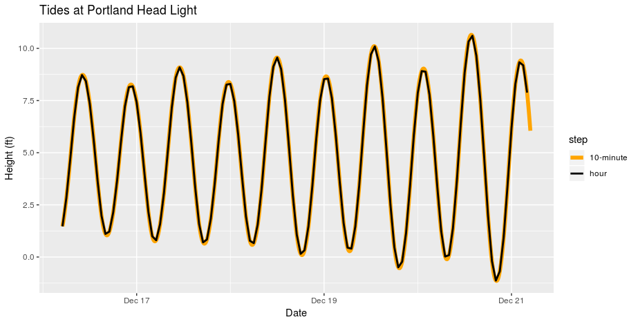

# maree

[maree](https://translate.google.com/#view=home&op=translate&sl=en&tl=fr&text=tide) is a small R package that wraps  around a local installation of [xtide](https://flaterco.com/xtide/). `maree` 
provides fuctionality to generate and read both `raw` and `plain` output modes. 
The `maree` package doesn't add any new functionality to `xtide`.

It is important to note there already exists nice alternatives including
[rtide](https://CRAN.R-project.org/package=rtide). We have found it handy to
have programmatic access to a [local installation](https://flaterco.com/xtide/installation.html) of the `xtide` application.

## Requirements

+ [xtide](https://flaterco.com/xtide/)

+ [R v3+](https://www.r-project.org/)

+ [rlang](https://CRAN.R-project.org/package=rlang)

+ [magrittr](https://CRAN.R-project.org/package=magrittr)

+ [tibble](https://CRAN.R-project.org/package=tibble)

+ [dplyr](https://CRAN.R-project.org/package=dplyr)

+ [tidyr](https://CRAN.R-project.org/package=tidyr)

+ [readr](https://CRAN.R-project.org/package=readr)

+ [xml2](https://CRAN.R-project.org/package=xml2)

+ [rvest](https://CRAN.R-project.org/package=rvest)

## Installation

Install from github.

```
devtools::install_github("BigelowLab\maree")
```

## Usage

### Listing available stations

Station (locations) are either reference (harmonic) or substations.  Each has a 
identifier and name.

```
library(maree)

# list all of the available stations
locs <- fetch_locations()
# # A tibble: 5,382 x 5
#    `Station ID` Name                                         Type  Latitude Longitude
#    <chr>        <chr>                                        <chr>    <dbl>     <dbl>
#  1 PCT3896_1    0.2 mile off Flat Point, Taku Inlet, Stephe… Sub       58.3    -134. 
#  2 PCT3901_1    0.2 mile off Taku Point, Taku Inlet, Stephe… Sub       58.4    -134. 
#  3 ACT8491_1    0.5 mile southeast of, Pinellas Point, Tamp… Sub       27.7     -82.6
#  4 8537731      0.8 n.mi. above entrance, Alloway Creek, Ne… Sub       39.5     -75.5
#  5 8537535      1 n.mi. above entrance, Mad Horse Creek, Ne… Sub       39.4     -75.4
#  6 ACT8496_1    1.9 miles SE of, Pinellas Point, Tampa Bay,… Sub       27.7     -82.6
#  7 8677833      2.5 miles above mouth, Little Satilla River… Sub       31.1     -81.5
#  8 8537753      2.5 n.mi. above entrance, Alloway Creek, Ne… Sub       39.5     -75.5
#  9 ACT8486_1    2.6 miles south of, Pinellas Point, Tampa B… Sub       27.7     -82.6
# 10 PCT0101_1    28th St. Pier (San Diego), 0.35 nmi. SW (De… Sub       32.7    -117. 
# # … with 5,372 more rows

# or fetch a subset 
locs <- fetch_locations(pattern = glob2rx("*Maine*"))
# # A tibble: 126 x 5
#    `Station ID` Name                                              Type  Latitude Longitude
#    <chr>        <chr>                                             <chr>    <dbl>     <dbl>
#  1 8417377      Androscoggin River entrance, Kennebec River, Mai… Sub       44.0     -69.9
#  2 8417144      Augusta, MCRR Bridge, Kennebec River, Maine       Ref       44.3     -69.8
#  3 8418175      Back Cove, Casco Bay, Maine                       Sub       43.7     -70.3
#  4 8416961      Back River, Sheepscot River, Maine                Sub       44.0     -69.7
#  5 8414612      Bangor, Penobscot River, Maine                    Ref       44.8     -68.8
#  6 8414612      Bangor, Penobscot River, Maine (sub)              Sub       44.8     -68.8
#  7 8413320      Bar Harbor, Frenchman Bay, Maine                  Ref       44.4     -68.2
#  8 8413651      Bass Harbor, Mount Desert Island, Maine           Sub       44.2     -68.4
#  9 8417227      Bath, Kennebec River, Maine                       Ref       43.9     -69.8
# 10 8417227      Bath, Kennebec River, Maine (sub)                 Sub       43.9     -69.8
# # … with 116 more rows
```

### Fetch the tide heights at a single location

You can specify the time interval and the step increment.  Note that locations
are made by simple pattern matching.  Where multiple matches are found the first
encountered is returned.  Use increasing specificity to match a particular location.

```
Portland <- get_raw_mode(location = "Portland", 
  time = as.POSIXct(c("1995-12-16 00:00:00", "1995-12-20 23:59:59"), tz = "UTC"),
  step = '01:00',
  ofile = "~/1995-12-16-rawtide.csv",
  compress = TRUE)

# $location
# [1] "Portland"
# 
# $file
# [1] "/home/btupper/tide.csv.gz"
# 
# $data
# # A tibble: 120 x 2
#    datetime            height
#    <dttm>               <dbl>
#  1 1995-12-16 05:00:00   1.47
#  2 1995-12-16 06:00:00   2.84
#  3 1995-12-16 07:00:00   4.70
#  4 1995-12-16 08:00:00   6.67
#  5 1995-12-16 09:00:00   8.14
#  6 1995-12-16 10:00:00   8.72
#  7 1995-12-16 11:00:00   8.43
#  8 1995-12-16 12:00:00   7.34
#  9 1995-12-16 13:00:00   5.61
# 10 1995-12-16 14:00:00   3.64
# # … with 110 more rows
```

The above provides the tide height every hour.  It is interesting to compare with
a higher sampling rate, say 10 minutes.

```
library(ggplot2)
Portland10 <-  get_raw_mode(location = "Portland", 
  time = as.POSIXct(c("1995-12-16 00:00:00", "1995-12-20 23:59:59"), tz = "UTC"),
  step = '00:10',
  ofile = "~/1995-12-16-10minute-rawtide.csv",
  compress = TRUE)

x <- dplyr::bind_rows(
  Portland$data %>% dplyr::mutate(step = "hour"),
  Portland10$data %>% dplyr::mutate(step = "10-minute")) %>%
  dplyr::group_by(step)

ggplot(x, aes(x=datetime, y = height, colour = step, size = step)) +
  geom_line() + 
  labs(title = "Tides at Portland Head Light", x = "Date", y = "Height (ft)") +
  scale_colour_manual(breaks = c("10-minute", "hour"), values = c("orange", "black")) +
  scale_size_manual(breaks = c("10-minute", "hour"), values = c(2,1))
```


They are quite close, so keep in mind that an hourly estimate is often sufficient for modeling purposes.


### Fetch tide-centric events for a single location

Events such as sun rise/set, moon rise/set and hi/lo tide stages can be extracted.  By default they are exported from `xtide` in one table [timestamp, event], but we find it 
useful to separate the events into sun. moon and tide.

```
Portland_events <- get_plain_mode(location = "Portland",
  time = as.POSIXct(c("1995-12-16 00:00:00", "1995-12-20 23:59:59"), tz = "UTC"),
  ofile = "~/1995-12-16-plaintide.csv",
  compress = TRUE)
# $location
# [1] "Portland Head Light, Casco Bay, Maine"
# 
# $lonlat
# [1] -70.2067  43.6233
# 
# $file
# [1] "~/1995-12-16-plaintide.csv.gz"
# 
# $moon
# # A tibble: 9 x 2
#   datetime            event   
#   <dttm>              <chr>   
# 1 1995-12-16 12:21:00 Moonset 
# 2 1995-12-17 01:42:00 Moonrise
# 3 1995-12-17 12:54:00 Moonset 
# 4 1995-12-18 02:50:00 Moonrise
# 5 1995-12-18 01:31:00 Moonset 
# 6 1995-12-19 04:00:00 Moonrise
# 7 1995-12-19 02:15:00 Moonset 
# 8 1995-12-20 05:11:00 Moonrise
# 9 1995-12-20 03:07:00 Moonset 
# 
# $sun
# # A tibble: 10 x 2
#    datetime            event  
#    <dttm>              <chr>  
#  1 1995-12-16 07:07:00 Sunrise
#  2 1995-12-16 04:04:00 Sunset 
#  3 1995-12-17 07:08:00 Sunrise
#  4 1995-12-17 04:04:00 Sunset 
#  5 1995-12-18 07:09:00 Sunrise
#  6 1995-12-18 04:05:00 Sunset 
#  7 1995-12-19 07:09:00 Sunrise
#  8 1995-12-19 04:05:00 Sunset 
#  9 1995-12-20 07:10:00 Sunrise
# 10 1995-12-20 04:06:00 Sunset 
# 
# $tide
# # A tibble: 19 x 3
#    datetime            height stage
#    <dttm>               <dbl> <chr>
#  1 1995-12-16 05:09:00  8.73  high 
#  2 1995-12-16 11:22:00  1.04  low  
#  3 1995-12-16 05:32:00  8.27  high 
#  4 1995-12-16 11:40:00  0.75  low  
#  5 1995-12-17 06:01:00  9.09  high 
#  6 1995-12-17 12:21:00  0.64  low  
#  7 1995-12-17 06:32:00  8.39  high 
#  8 1995-12-18 12:36:00  0.580 low  
#  9 1995-12-18 06:56:00  9.56  high 
# 10 1995-12-18 01:20:00  0.09  low  
# 11 1995-12-18 07:31:00  8.66  high 
# 12 1995-12-19 01:32:00  0.28  low  
# 13 1995-12-19 07:50:00  0.11  high 
# 14 1995-12-19 02:16:00  0.54  low  
# 15 1995-12-19 08:28:00  9.03  high 
# 16 1995-12-20 02:27:00  0.11  low  
# 17 1995-12-20 08:43:00  0.65  high 
# 18 1995-12-20 03:10:00  1.15  low  
# 19 1995-12-20 09:22:00  9.42  high 
```
